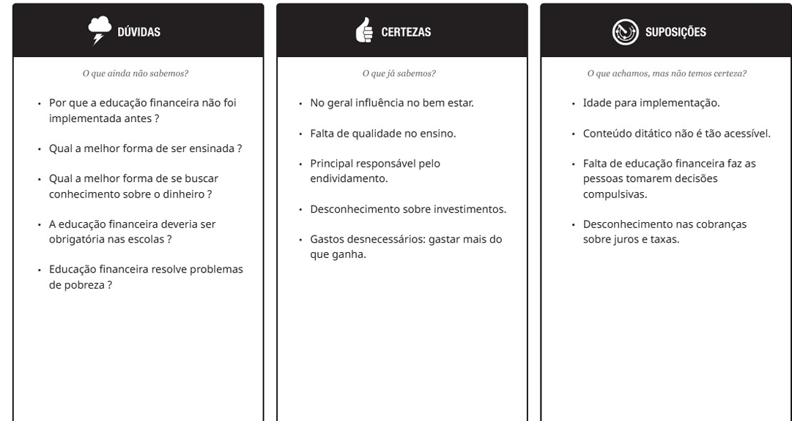

# Introdução

## Problema

> Nesse momento você deve apresentar o problema que a sua aplicação deve
> resolver. No entanto, não é a hora de comentar sobre a aplicação.
> Descreva também o contexto em que essa aplicação será usada, se
> houver: empresa, tecnologias, etc. Novamente, descreva apenas o que de
> fato existir, pois ainda não é a hora de apresentar requisitos
> detalhados ou projetos.
>
> Nesse momento, o grupo pode optar por fazer uso
> de ferramentas como Design Thinking, que permite um olhar de ponta a
> ponta para o problema.

Muitos brasileiros não possuem acesso à uma educação de qualidade, e menos ainda quando se trata do aspecto financeiro. Neste contexto, surgem alguns problemas como a não identificação de um impacto de uma taxa de juros abusiva em financiamentos, empréstimos e até faturas de cartão de crédito. Outro problema que surge é o total desconhecimento a respeito sobre investimentos, o que acaba abrindo espaço para aplicações de golpes financeiros, dos quais promotem rentabilidades fora dos padrões oferecidos pelos mercados e livres de qualquer tipo de risco. Além disso, fatores como compras impulsivas, ausência de uma reserva de emergência e falta de planejamento intensificam o problema, podendo influenciar até mesmo a aposentadoria de muitos.
A partir disso, uma aplicação será feita para ser usada em escolas, aplicativos do governo e páginas web.

> **Links Úteis**:
>
> - [Objetivos, Problema de pesquisa e Justificativa](https://medium.com/@versioparole/objetivos-problema-de-pesquisa-e-justificativa-c98c8233b9c3)
> - [Matriz Certezas, Suposições e Dúvidas](https://medium.com/educa%C3%A7%C3%A3o-fora-da-caixa/matriz-certezas-suposi%C3%A7%C3%B5es-e-d%C3%BAvidas-fa2263633655)
> - [Brainstorming](https://www.euax.com.br/2018/09/brainstorming/)

## Objetivos

> Aqui você deve descrever os objetivos do trabalho indicando que o
> objetivo geral é desenvolver um software para solucionar o problema
> apresentado acima. Apresente também alguns (pelo menos 2) objetivos
> específicos dependendo de onde você vai querer concentrar a sua
> prática investigativa, ou como você vai aprofundar no seu trabalho.
>
> **Links Úteis**:
>
> - [Objetivo geral e objetivo específico: como fazer e quais verbos utilizar](https://blog.mettzer.com/diferenca-entre-objetivo-geral-e-objetivo-especifico/)

Desenvolver um software para amenizar a falta de educação financeira, bem como ensinar sobre investimentos, fazer um orçamento, montar uma reserva de emergência, sanar dúvidas e diminuir gastos impulsivos.

## Justificativa

> Descreva a importância ou a motivação para trabalhar com esta aplicação
> que você escolheu. Indique as razões pelas quais você escolheu seus
> objetivos específicos ou as razões para aprofundar em certos aspectos
> do software.
>
> O grupo de trabalho pode fazer uso de questionários, entrevistas e
> dados estatísticos, que podem ser apresentados, com o objetivo de
> esclarecer detalhes do problema que será abordado pelo grupo.
>
> **Links Úteis**:
>
> - [Como montar a justificativa](https://guiadamonografia.com.br/como-montar-justificativa-do-tcc/)

Uma das motivações foi o fato de que a tecnologia está cada vez mais presente na vida das pessoas, portanto ao usarmos esta aplicação estaremos unindo algo que está no cotidiano com algo realmente útil.
As razões pelas quais escolhemos os objetivos específicos foi o fato de termos empatia com as pessoas, pois segundo alguns estudos, inúmeros brasileiros estão endividados e inadimpletes ou não possuem qualquer tipo de planejamento financeiro e não se preocupam com o longo prazo, portanto, se pudermos ajuda-los, já estaríamos melhorando suas qualidades de vida e bem-estar.

## Público-Alvo

> Descreva quem serão as pessoas que usarão a sua aplicação indicando os
> diferentes perfis. O objetivo aqui não é definir quem serão os
> clientes ou quais serão os papéis dos usuários na aplicação. A ideia
> é, dentro do possível, conhecer um pouco mais sobre o perfil dos
> usuários: conhecimentos prévios, relação com a tecnologia, relações
> hierárquicas, etc.
>
> Adicione informações sobre o público-alvo por meio de uma descrição
> textual, ou diagramas de personas, mapa de stakeholders, ou como o
> grupo achar mais conveniente.
>
> **Links Úteis**:
>
> - [Público-alvo: o que é, tipos, como definir seu público e exemplos](https://klickpages.com.br/blog/publico-alvo-o-que-e/)
> - [Qual a diferença entre público-alvo e persona?](https://rockcontent.com/blog/diferenca-publico-alvo-e-persona/)
>   O público-alvo da aplicação é composto por uma diversidade de faixas etárias, incluindo crianças, jovens, adultos e idosos que desejam melhorar sua organização financeira, mas que possuem pouco ou nenhum conhecimento na área.
>   Sobre o perfil tecnológico, espera-se que os usuários tenham alguma familiaridade com computadores e celuares e não precisam de ferramentas financeiras complexas. Portanto a aplicação deve ser simples, didática e acessível.
>   Quanto às relações hierárquicas, a aplicação é voltada para uso individual, sem necessidade de níveis complexos de acesso.
