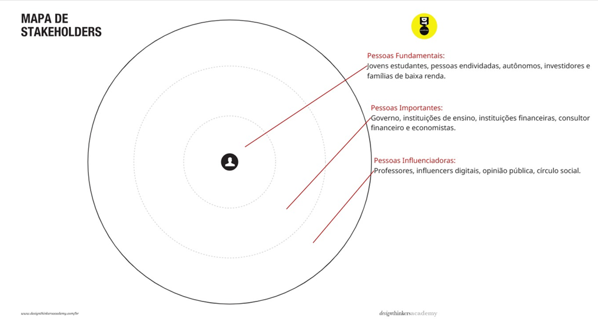
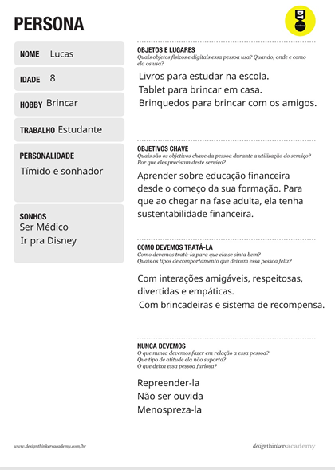
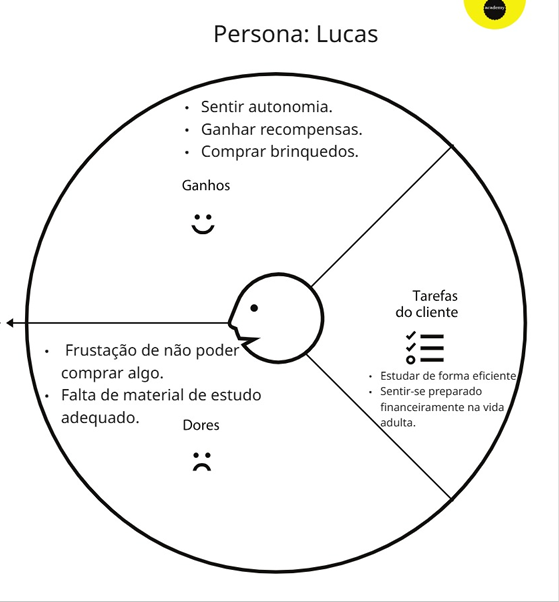
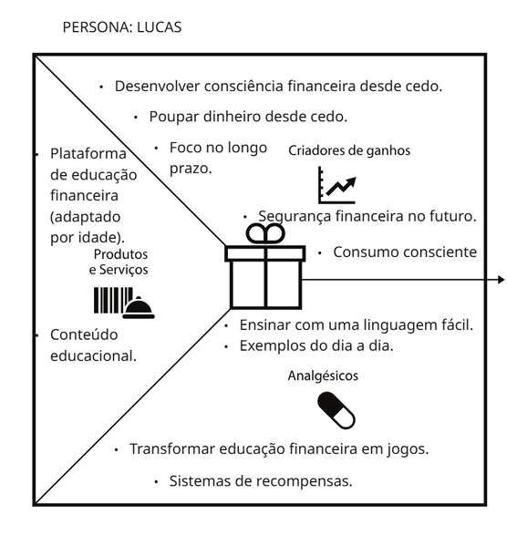
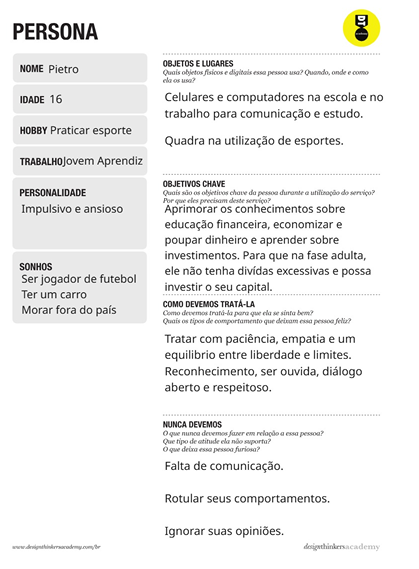
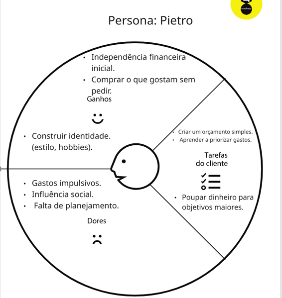
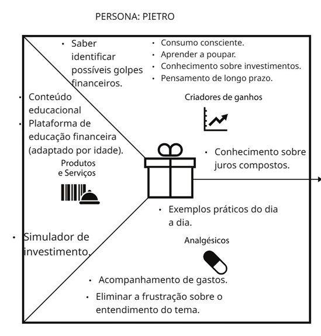
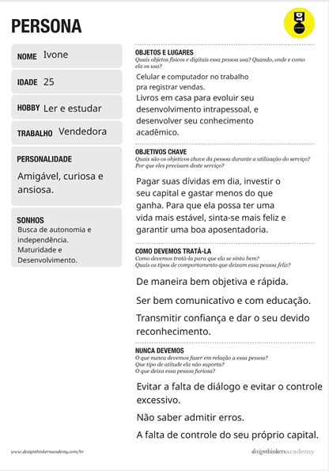
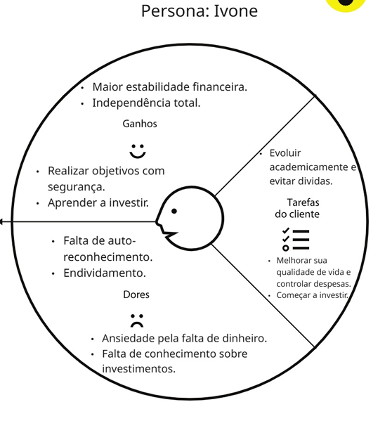
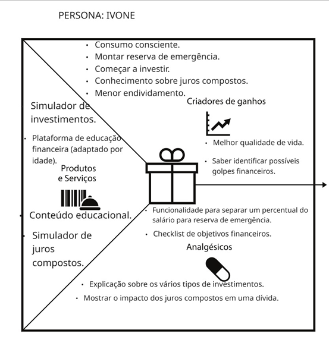

# Especificações Do Projeto

Pré-requisitos: <a href="1-Contexto.md"> Documentação de Contexto</a>

> Apresente uma visão geral do que será abordado nesta parte do
> documento, enumerando as técnicas e/ou ferramentas utilizadas para
> realizar a especificações do projeto

**Pesquisa e entendimento do problema:**

**Endividamento**
A falta de educação financeira no Brasil leva ao endividamento, agravado pelo fácil acesso ao crédito. Em 2021, 69,7% das famílias estavam endividadas e 26,7% inadimplentes, com destaque para o uso do cartão de crédito. O cartão de crédito, desde 2010, é a maior causa de endividamento familiar, sendo, em 2021, responsável por 81,8% do total de famílias endividadas. A pesquisa mostra que muitos não sabem administrar suas finanças, e aponta a educação financeira como solução para melhorar a organização do dinheiro e a qualidade de vida.

**Falta de conhecimento sobre investimentos**
Em novembro de 2025, o banco Máster foi liquidado pelo Banco Central após uma série de irregularidades financeiras, sendo a principal delas a comercialização de CDB's (Certificado de Depósito Bancário) com taxas de retornos impraticáveis chegando a 140% do CDI. Esses produtos acabaram gerando desconfiança no mercado, pois o banco não conseguia honrar com seus compromissos nas datas de vencimento. Esta liquidação acabou prejudicando cerca de 12 milhões de pessoas que tinham seus dinheiros depositados neste banco.

**Dívida financeira na terceira idade**
A necessidade de cobrir dívidas de cartões de crédito leva muitos idosos a fazerem empréstimos consignados, que comprometem parte da aposentadoria. Dados da Serasa indicam que 18,1% dos mais de 71 milhões de inadimplentes no Brasil têm mais de 60 anos. 

## Personas

Pedro Paulo tem 26 anos, é arquiteto recém-formado e autônomo. Pensa em
se desenvolver profissionalmente através de um mestrado fora do país,
pois adora viajar, é solteiro e sempre quis fazer um intercâmbio. Está
buscando uma agência que o ajude a encontrar universidades na Europa
que aceitem alunos estrangeiros.

> Enumere e detalhe as personas da sua solução. Para
> tanto, baseie-se tanto nos documentos disponibilizados na disciplina
> e/ou nos seguintes links:
>
> **Links Úteis**:
>
> - [Rock Content](https://rockcontent.com/blog/personas/)
> - [Hotmart](https://blog.hotmart.com/pt-br/como-criar-persona-negocio/)
> - [O que é persona?](https://resultadosdigitais.com.br/blog/persona-o-que-e/)
> - [Persona x Público-alvo](https://flammo.com.br/blog/persona-e-publico-alvo-qual-a-diferenca/)
> - [Mapa de Empatia](https://resultadosdigitais.com.br/blog/mapa-da-empatia/)
> - [Mapa de Stalkeholders](https://www.racecomunicacao.com.br/blog/como-fazer-o-mapeamento-de-stakeholders/)
>
> Lembre-se que você deve ser enumerar e descrever precisamente e
> personalizada todos os clientes ideais que sua solução almeja.

## Histórias de Usuários

Com base na análise das personas forma identificadas as seguintes histórias de usuários:

| EU COMO... `PERSONA` | QUERO/PRECISO ... `FUNCIONALIDADE` | PARA ... `MOTIVO/VALOR`                |
| -------------------- | ---------------------------------- | -------------------------------------- |
| Usuário do sistema   | Registrar minhas tarefas           | Não esquecer de fazê-las               |
| Administrador        | Alterar permissões                 | Permitir que possam administrar contas |

> Apresente aqui as histórias de usuário que são relevantes para o
> projeto de sua solução. As Histórias de Usuário consistem em uma
> ferramenta poderosa para a compreensão e elicitação dos requisitos
> funcionais e não funcionais da sua aplicação. Se possível, agrupe as
> histórias de usuário por contexto, para facilitar consultas
> recorrentes à essa parte do documento.
>
> **Links Úteis**:
>
> - [Histórias de usuários com exemplos e template](https://www.atlassian.com/br/agile/project-management/user-stories)
> - [Como escrever boas histórias de usuário (User Stories)](https://medium.com/vertice/como-escrever-boas-users-stories-hist%C3%B3rias-de-usu%C3%A1rios-b29c75043fac)

1- Eu como: Aluno (a) do ensino básico.
Quero: Estudar educação financeira com qualidade.
Porque/para: Para que no futuro, eu possa lidar com o dinheiro da melhor forma.

2- Eu como: Aluno (a) do ensino médio.
Quero: Estudar educação financeira com qualidade.
Porque/para: Para já começar a aplicar os conhecimentos na transição da
adolescência para a fase adulta.

3- Eu como: Jovem trabalhador (a).
Quero: Guardar um pouco de dinheiro todo mês.
Porque/para: Montar uma reserva de emergência.

4- Eu como: Trabalhador (a).
Quero: Aprender sobre investimentos básicos.
Porque/Para: Começar a fazer meu dinheiro render.

5- Eu como: Aposentado (a).
Quero: Ter estabilidade na terceira idade.
Porque/para: Aproveitar uma aposentadoria saudável financeiramente.

6- Eu como: Investidor (a).
Quero: Ter acesso a conteúdos didáticos e ferramentas de gestão financeira.
Porque/para: Para que eu possa investir melhor meu capital.

7- Eu como: Pessoa endividada.
Quero: Pagar as contas em dia.
Porque/Para: Maior bem-estar e melhor saúde mental.

## Requisitos

As tabelas que se seguem apresentam os requisitos funcionais e não funcionais que detalham o escopo do projeto.

### Requisitos Funcionais

| ID     | Descrição do Requisito                  | Prioridade |
| ------ | --------------------------------------- | ---------- |
| RF-001 | Permitir que o usuário cadastre tarefas | ALTA       |
| RF-002 | Emitir um relatório de tarefas no mês   | MÉDIA      |

### Requisitos não Funcionais

| ID      | Descrição do Requisito                                            | Prioridade |
| ------- | ----------------------------------------------------------------- | ---------- |
| RNF-001 | O sistema deve ser responsivo para rodar em um dispositivos móvel | MÉDIA      |
| RNF-002 | Deve processar requisições do usuário em no máximo 3s             | BAIXA      |

> Com base nas Histórias de Usuário, enumere os requisitos da sua
> solução. Classifique esses requisitos em dois grupos:
>
> - [Requisitos Funcionais
>   (RF)](https://pt.wikipedia.org/wiki/Requisito_funcional):
>   correspondem a uma funcionalidade que deve estar presente na
>   plataforma (ex: cadastro de usuário).
> - [Requisitos Não Funcionais
>   (RNF)](https://pt.wikipedia.org/wiki/Requisito_n%C3%A3o_funcional):
>   correspondem a uma característica técnica, seja de usabilidade,
>   desempenho, confiabilidade, segurança ou outro (ex: suporte a
>   dispositivos iOS e Android).
>
> Lembre-se que cada requisito deve corresponder à uma e somente uma
> característica alvo da sua solução. Além disso, certifique-se de que
> todos os aspectos capturados nas Histórias de Usuário foram cobertos.

## Restrições

O projeto está restrito pelos itens apresentados na tabela a seguir.

| ID  | Restrição                                             |
| --- | ----------------------------------------------------- |
| 01  | O projeto deverá ser entregue até o final do semestre |
| 02  | Não pode ser desenvolvido um módulo de backend        |

> Enumere as restrições à sua solução. Lembre-se de que as restrições
> geralmente limitam a solução candidata.
>
> **Links Úteis**:
>
> - [O que são Requisitos Funcionais e Requisitos Não Funcionais?](https://codificar.com.br/requisitos-funcionais-nao-funcionais/)
> - [O que são requisitos funcionais e requisitos não funcionais?](https://analisederequisitos.com.br/requisitos-funcionais-e-requisitos-nao-funcionais-o-que-sao/)
