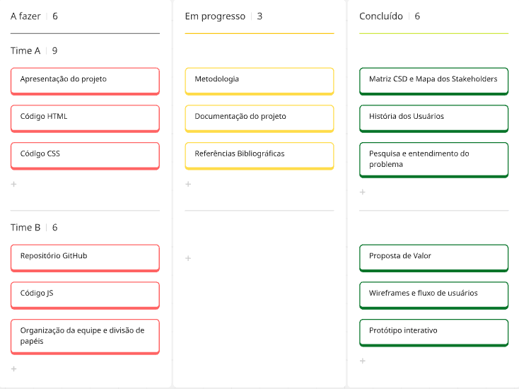

# Gerenciamento de Projeto

> Aqui será feito o gerenciamento das tarefas de implementação do projeto.

## Divisão de Papéis

> Apresente a divisão de papéis entre os membros do grupo em cada sprint. O desejável é que, em cada sprint, o aluno assuma papéis diferentes na disciplina. Siga o modelo do exemplo abaixo:

Organização da equipe e divisão de papéis: Durante a imersão e análise do projeto, foram feitas atividades como a elaboração da Matriz CSD, criação de Personas e definição da Proposta de Valor. Essas atividades foram desenvolvidas durante reuniões em que a maioria dos integrantes estava presente, com posterior comunicação com os membros ausentes. A equipe se organizou por meio de divisão de tarefas entre os integrantes, de acordo com as demandas de cada etapa. A colaboração simultânea e à distância foi feita através da ferramenta de diagramação e colaboração Miro.

### Sprint 1

- Main:Iniciar Teste: Andréia Lopes do Couto Santo
- Simulador Investimentos: Henrique Shevchenko da Cunha Lopes Ferreira
- Footer: Luís Felipe de Oliveira Silva
- Categorias: Thiago Henrique Marques Soares
- Header: Thiago Pereira Figueiredo

### Sprint 2

- Configurações: Conteúdos ofertados aos usuários : Andréia Lopes do Couto Santo
- Configurações: Conteúdos ofertados aos usuários : Henrique Shevchenko da Cunha Lopes Ferreira
- Quiz de teste de conhecimentos : Luís Felipe de Oliveira Silva
- Simulador de métodos e simulador de orçamentos : Thiago Henrique Marques Soares 
- Configurações: Página de Login, JavaScript : Thiago Pereira Figueiredo

## Quadro de tarefas

> Apresente a divisão de tarefas entre os membros do grupo e o acompanhamento da execução, conforme exemplo abaixo.

Atualizado em: 30/06/2026
Sprint 1:

| Responsável | Tarefa/Requisito | Iniciado em |   Prazo   | Status | Terminado em |
|:------------|:-----------------|:-----------:|:----------:|:------:|:-------------:|
| Andreia     | Iniciar teste    | 19/04/2026  | 19/05/2026 |   ✔️   | 18/05/2026    |
| Henrique    | Simulador        | 19/04/2026  | 19/05/2026 |   ✔️   | 18/05/2026    |
| Luís        | Footer           | 19/04/2026  | 19/05/2026 |   ✔️   | 18/05/2026    |
| Thiago H    | Categorias       | 19/04/2026  | 19/05/2026 |   ✔️   | 18/05/2026    |
| Thiago P    | Configurações    | 19/04/2026  | 19/05/2026 |   ✔️   | 18/05/2026    |

Sprint 2:

| Responsável | Tarefa/Requisito | Iniciado em |   Prazo   | Status | Terminado em |
|:------------|:-----------------|:-----------:|:----------:|:------:|:-------------:|
| Andreia     | Conteúdos        | 16/05/2026  | 07/06/2026 |   ✔️   | 06/06/2026    |
| Henrique    | Conteúdos        | 16/05/2026  | 07/06/2026 |   ✔️   | 06/06/2026    |
| Luís        | Quiz             | 16/05/2026  | 07/06/2026 |   ✔️   | 06/06/2026    |
| Thiago H    | Simuladores      | 16/05/2026  | 07/06/2026 |   ✔️   | 06/06/2026    |
| Thiago P    | Login            | 16/05/2026  | 07/06/2026 |   ✔️   | 06/06/2026    |

Legenda:

- ✔️: terminado
- 📝: em execução
- ⌛: atrasado
- ❌: não iniciado

## Ferramentas

> Liste quais ferramentas foram empregadas no desenvolvimento do projeto, justificando a escolha de cada uma delas. Use o formato abaixo como exemplo.

As ferramentas empregadas no projeto são:

- Editor de código.
- Ferramentas de diagramação.
- Frameworks
- Outras ferramentas externas

* Editor de código- Visual Studio Code: plataforma usada para escrever e editar os códigos. [linkVisualStudioCode](code.visualstudio.com/download)

* Discord Ferramentas de comunicação- o Discord é usado para reuniões semanais do grupo, facilitando a comunicação simultânea entre os integrantes. O WhatsApp é utilizado para trocas de mensagens e alinhamentos pontuais. [linkDiscord](discord.com/app)

* Ferramentas de diagramação- Miro: utilizado para a criação dos projetos, como Mapa de Stakeholders, Personas, Mapa de Proposta de Valor e Histórias de Usuário, permitindo trabalho simultâneo entre os membros da equipe. [linkMiro](miro.com)

## Links Úteis

> - [11 Passos Essenciais para Implantar Scrum no seu Projeto](https://mindmaster.com.br/scrum-11-passos/)
> - [Scrum em 9 minutos](https://www.youtube.com/watch?v=XfvQWnRgxG0)

