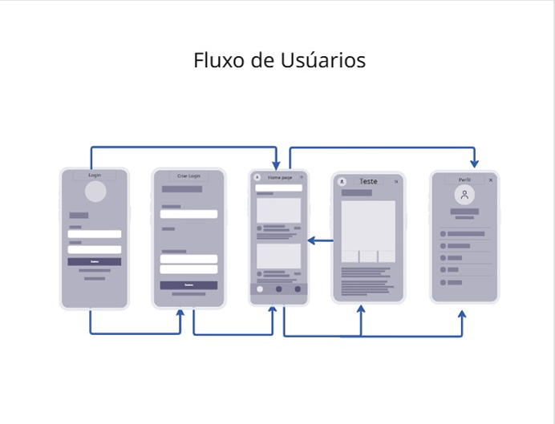

# Projeto da Solução

Pré-requisitos: <a href="4-Gestão-Configuração.md"> Ambiente e Ferramentas de Trabalho</a>

1.1 Funcionalidades para Usuários 

1.1.1 Página Inicial e Diagnóstico de Perfil Financeiro 

Tela inicial (index.html) que apresenta a proposta da plataforma e oferece um formulário diagnóstico ("Iniciar Teste"), exibido em um modal do Bootstrap. O usuário informa seu nível de conhecimento financeiro, faixa etária, objetivos financeiros (investimentos, planejamento, aposentadoria e/ou dívidas), renda mensal e um comentário opcional. Essas respostas são usadas posteriormente para personalizar os conteúdos recomendados ao usuário. 

Estrutura de dados associada: respostasForm (db.json) — registro com nivel, faixa, objetivos[], salario, comentario e id gerado automaticamente. 

Instruções de acesso e uso: Acessível na rota raiz da aplicação (index.html), seção "Home". O usuário clica em "Iniciar Teste", preenche o formulário e clica em "Enviar". O envio é feito via JavaScript (configuracoes.js), com requisição POST para http://localhost:3000/respostasForm. O id retornado pelo servidor é salvo no localStorage do navegador (chave usuarioId) para identificar o usuário em sessões futuras. 

 

1.1.2 Navegação por Categorias de Conteúdo Educacional 

Bloco "Categorias" na página inicial, com acesso a quatro páginas de conteúdo: Investimentos, Planejamentos, Aposentadoria e Dívidas. Cada página exibe título, descrição, lista de vantagens, cards com os principais tipos/métodos relacionados ao tema e uma dica final. 

Estrutura de dados associada: investimentos, planejamentos, aposentadoria e dividas (objetos em db.json), cada um contendo título, descrição, vantagens[], dica e uma lista de itens (tiposInvestimento, tiposMetodo, tiposAposentadoria ou tiposDivida). 

Instruções de acesso e uso: Acessível pelos botões da seção "Categorias" em index.html ou diretamente pelas páginas investimentos.html, planejamentos.html, aposentadoria.html e dividas.html. Ao carregar a página (evento onload), a função correspondente em categorias.js realiza uma requisição GET ao endpoint do JSON Server (ex.: http://localhost:3000/investimentos) e monta dinamicamente o HTML com os dados retornados. 

 

1.1.3 Simulador de Métodos de Planejamento Financeiro 

Disponível na página de Planejamentos, permite ao usuário escolher um dos métodos de divisão de renda (50/30/20, 50/35/15, 70/30 ou Método dos 6 potes), informar sua renda total e visualizar, por meio de uma sequência de prompts/alerts, o valor sugerido para cada categoria de gasto. 

Estrutura de dados associada: planejamentos.tiposMetodo (db.json) — utilizado apenas como referência de conteúdo; o cálculo da simulação é feito em memória, no navegador, sem persistência em banco de dados. 

Instruções de acesso e uso: Acessível pelo botão "Simular Métodos" na página planejamentos.html. O botão abre uma caixa de diálogo (prompt) para escolha do método e da renda; o resultado é exibido em um alert com os valores calculados (função SimularMetodos em categorias.js). 

 

1.1.4 Simulador de Orçamento Pessoal 

Ferramenta (orcamento.html) que permite ao usuário cadastrar suas rendas e despesas, gerando um resultado consolidado com total de receitas, total de despesas, saldo final e uma mensagem de avaliação (ex.: alerta de gastos acima da renda, margem de sobra boa, etc.). Também permite reiniciar a simulação, apagando os lançamentos anteriores. 

Estrutura de dados associada: rendas[] e despesas[] (db.json). Cada renda contém valor e data; cada despesa contém descricao, valor e data. 

Instruções de acesso e uso: Acessível pelo botão "Simular Orçamento" na página de Planejamentos, que direciona para orcamento.html. O usuário informa o valor da renda ("Adicionar Renda") e/ou descrição e valor de uma despesa ("Adicionar Despesa"); cada lançamento é enviado via POST para http://localhost:3000/rendas ou http://localhost:3000/despesas (orcamento.js). Ao clicar em "Criar Orçamento", os dados são buscados (GET) e o resultado é calculado e exibido. O botão "Nova simulação" remove (DELETE) todos os registros salvos, após confirmação do usuário. 

 

1.1.5 Simulador Financeiro de Investimentos 

Calculadora de rendimento (seção "Simulador Financeiro" em index.html) que projeta o valor futuro de um aporte financeiro, considerando três modalidades: Poupança (taxa nominal mensal), CDB/Tesouro Direto (percentual do CDI) e LCI/LCA (taxa anual equivalente). O usuário informa o valor do aporte, a taxa de juros e o tempo de aplicação em meses; o sistema calcula o montante final por juros compostos e mantém um histórico de simulações realizadas, com opção de limpar todo o histórico. 

Estrutura de dados associada: simulacoes[] (db.json) — cada simulação registra dataHora, aporte, juros, tempo, tipo e total. 

Instruções de acesso e uso: Acessível na seção "Simulador Financeiro" da página inicial. O usuário seleciona o tipo de investimento (que altera dinamicamente o rótulo e a ajuda do campo de juros), informa aporte, taxa e tempo, e clica em "Calcular Rendimento" (função simular em simulacoes.js). O resultado é salvo via POST em http://localhost:3000/simulacoes e o histórico é recarregado (GET) na tabela abaixo do formulário. O botão "Limpar Tudo" remove (DELETE) todos os registros do histórico, após confirmação. 

 

1.1.6 Quiz de Educação Financeira 

Mini-jogo de perguntas e respostas (seção "Quiz de Educação Financeira") com perguntas de múltipla escolha sobre conceitos financeiros (reserva de emergência, juros compostos, hábitos de controle financeiro e tipos de investimento). Ao final, exibe a pontuação obtida pelo usuário. 

Estrutura de dados associada: perguntas[] (dbquiz.json) — cada pergunta contém pergunta, alternativas[] e o índice da alternativa correta. 

Instruções de acesso e uso: Acessível pelo botão "Iniciar Quiz" na página inicial. As perguntas são carregadas via GET em http://localhost:3000/perguntas (scriptquiz.js). A cada pergunta, o usuário seleciona uma alternativa; o sistema sinaliza visualmente a opção correta e a escolhida (se errada) e avança para a próxima pergunta pelo botão "Próxima", até a exibição do resultado final. 

 

1.1.7 Painel "Meu Perfil" (Dashboard do Usuário) 

Área de configurações pessoais, acessada a partir do botão "Perfil" do cabeçalho, que alterna a página para uma visão de dashboard. Permite alternar o tema visual do sistema (claro/escuro) e atualizar dados cadastrais como e-mail e senha (campos de interface; a persistência desses dados não está implementada no backend atual). 

Estrutura de dados associada: Não há estrutura de dados persistida para tema/e-mail/senha; o tema é aplicado via classe CSS no elemento body (configuracoes.js). 

Instruções de acesso e uso: No cabeçalho de qualquer página principal, clicar em "Perfil" alterna para a view do dashboard (toggleView('dashboard')). No menu lateral, é possível clicar em "Claro" ou "Escuro" para alterar o tema (setTheme), preencher os campos de e-mail/senha e clicar em "Atualizar Dados". O botão de seta no topo do menu lateral retorna à tela inicial. 

 

1.1.8 Conteúdos Recomendados e Histórico de Visitação 

Dentro do painel "Meu Perfil", o botão "Conteúdos" gera uma vitrine de cards personalizada de acordo com o perfil financeiro informado anteriormente pelo usuário (ou, na ausência de formulário preenchido, exibe as quatro categorias gerais). Cada vez que o usuário acessa um conteúdo recomendado, a visita é registrada para fins de histórico. 

Estrutura de dados associada: respostasForm (para identificar os objetivos do usuário) e historicoVisitacao[] (db.json) — cada registro contém usuarioId, objetivos[] e conteudosVisitados[] (nome, pagina, visitadoEm). 

Instruções de acesso e uso: No painel "Meu Perfil", clicar em "Conteúdos". O sistema busca o id do usuário salvo no localStorage (ou o último formulário cadastrado, na ausência dele), consulta as categorias (investimentos, planejamentos, aposentadoria, dividas) e monta os cards priorizando os objetivos informados pelo usuário. Ao clicar em um card, é feita uma busca/atualização (GET + PATCH/POST) em http://localhost:3000/historicoVisitacao para registrar o conteúdo acessado (configuracoes.js). 

 

1.1.9 Rodapé: Redes Sociais e Solicitação de Ajuda/Suporte 

Rodapé presente em todas as páginas, com links para as redes sociais oficiais da plataforma e um botão "Precisa de ajuda?" que abre um formulário de contato em modal, permitindo enviar nome e mensagem de dúvida. Ao enviar, é aberto automaticamente um cliente de e-mail (mailto) pré-preenchido com os dados informados. 

Estrutura de dados associada: redesSociais[] e ajudas[] (dbfooter.json). redesSociais contém nome e link; ajudas contém nome, mensagem e data. 

Instruções de acesso e uso: No rodapé de qualquer página, clicar em um ícone de rede social abre o respectivo site em nova aba (scriptfooter.js). Clicar em "Precisa de ajuda?" abre o modal de suporte; ao preencher nome e mensagem e enviar, os dados são gravados via POST em http://localhost:3000/ajudas e, em seguida, é aberto um link mailto para suporte@empresa.com com os dados preenchidos. 

 

1.2 Funcionalidades para Administradores 

A solução não possui uma interface gráfica de administração dedicada (back-office). A camada de dados é servida por um JSON Server, que expõe automaticamente uma API REST completa (GET, POST, PUT, PATCH e DELETE) sobre os arquivos db.json, dbfooter.json e dbquiz.json. A "administração" da solução, portanto, ocorre por meio da edição direta desses arquivos-fonte e/ou por chamadas autenticadas à API REST gerada, conforme detalhado a seguir. 

1.2.1 Gestão de Conteúdo Educacional por Categoria 

Permite criar, editar ou remover o conteúdo exibido nas páginas de Investimentos, Planejamentos, Aposentadoria e Dívidas (títulos, descrições, vantagens, dicas e a lista de tipos/métodos de cada categoria), sem necessidade de alterar o código-fonte das páginas, já que o conteúdo é carregado dinamicamente via API. 

Estrutura de dados associada: investimentos, planejamentos, aposentadoria, dividas (db.json). 

Instruções de acesso e uso: Edição direta do arquivo db.json (ambiente de desenvolvimento) ou, com o JSON Server em execução (json-server --watch db.json), envio de requisições PUT/PATCH para os endpoints http://localhost:3000/investimentos, /planejamentos, /aposentadoria e /dividas com o novo conteúdo em formato JSON. 

 

1.2.2 Gestão do Banco de Perguntas do Quiz 

Permite incluir, alterar ou remover perguntas e alternativas do Quiz de Educação Financeira, controlando o nível de dificuldade e os temas abordados. 

Estrutura de dados associada: perguntas[] (dbquiz.json). 

Instruções de acesso e uso: Edição direta do arquivo dbquiz.json ou requisições POST/PUT/PATCH/DELETE ao endpoint http://localhost:3000/perguntas (servido a partir de dbquiz.json), informando pergunta, alternativas[] e o índice correta. 

 

1.2.3 Gestão de Solicitações de Ajuda/Suporte 

Permite consultar todas as solicitações de ajuda enviadas pelos usuários pelo formulário do rodapé (nome, mensagem e data) e removê-las após o devido atendimento. 

Estrutura de dados associada: ajudas[] (dbfooter.json). 

Instruções de acesso e uso: Consulta via GET em http://localhost:3000/ajudas; remoção de itens já atendidos via DELETE em http://localhost:3000/ajudas/{id}. Não há, atualmente, uma tela própria para essa consulta — o acesso é feito diretamente pela API ou pelo arquivo dbfooter.json. 

 

1.2.4 Gestão de Redes Sociais 

Permite atualizar os links das redes sociais exibidos no rodapé de todas as páginas da aplicação (Instagram, Facebook e LinkedIn), bem como adicionar novas redes. 

Estrutura de dados associada: redesSociais[] (dbfooter.json). 

Instruções de acesso e uso: Edição direta do arquivo dbfooter.json ou requisições PUT/PATCH/POST ao endpoint http://localhost:3000/redesSociais. Observação: no front-end atual (scriptfooter.js), as URLs estão fixas no código; uma evolução natural seria ler esses links diretamente da API. 

 

1.2.5 Monitoramento do Diagnóstico e do Histórico de Visitação dos Usuários 

Permite acompanhar os perfis financeiros coletados pelo formulário inicial (nível de conhecimento, faixa etária, objetivos, renda) e o histórico de conteúdos acessados por cada usuário, possibilitando análises sobre quais temas (investimentos, planejamento, aposentadoria, dívidas) geram mais interesse e engajamento. 

Estrutura de dados associada: respostasForm[] e historicoVisitacao[] (db.json). 

Instruções de acesso e uso: Consulta via GET em http://localhost:3000/respostasForm e http://localhost:3000/historicoVisitacao, podendo ser filtrada por usuário (ex.: ?usuarioId={id}) para fins de relatório ou análise externa (ex.: exportação para planilha).

Estrutura de dados:
{
  "investimentos": {
    "id": 1,
    "titulo": "Investimentos",
    "descrição": "Os investimentos são poderosos mecanismos para fazer o dinheiro trabalhar para você !",
    "vantagens": [
      "Rendimentos superiores à poupança",
      "Protege o capital contra a inflação",
      "Possibilidade de renda passiva",
      "Construção de patrimônio no longo prazo",
      "Realização de sonhos e metas"
    ],
    "dica": "Antes de investir, conheça os riscos, seu perfil e seus objetivos !",
    "tiposInvestimento": [
      {
        "id": 1,
        "nome": "CDB",
        "classificação": "Renda fixa",
        "descrição": "Certificado de Depósito Bancário, na qual se empresta dinheiro para o banco e em troca recebe juros"
      },
      {
        "id": 2,
        "nome": "Tesouro Direto",
        "classificação": "Renda fixa",
        "descrição": "Títulos públicos federais de baixo risco e alta previsibilidade, basicamente se empresta dinheiro para o governo e em troca recebe juros"
      },
      {
        "id": 3,
        "nome": "LCI/LCA",
        "classificação": "Renda fixa",
        "descrição": "Títulos isentos de IR lastreados em crédito imobiliário ou do agronegócio."
      },
      {
        "id": 4,
        "nome": "Ações",
        "classificação": "Renda variável",
        "descrição": "Menor fração de uma empresa e geralmente são negociadas na Bolsa de Valores, podendo auferir lucros com ganho de capital e recebimento de proventos. Porém, possui um risco maior"
      },
      {
        "id": 5,
        "nome": "Fundos de Investimento Imobiliário (FII'S)",
        "classificação": "Renda variável",
        "descrição": "São fundos que reúnem capital de vários investidores para aplicar no mercado imobiliário. Ao comprar um cota, o investidor tem o direito de receber parte dos lucros e dos aluguéis proporcionais."
      },
      {
        "id": 6,
        "nome": "Criptomoedas",
        "classificação": "Renda variável",
        "descrição": "Investimento de risco extremamente alto, na qual se investe em ativos digitais"
      }
    ]
  },
  "planejamentos": {
    "id": 2,
    "titulo": "Planejamentos",
    "descricao": "O planejamento é de suma importância para um maior controle da vida financeira, garatindo mais qualidade de vida !",
    "vantagens": [
      "Organização de receitas e despesas",
      "Alocações de gastos bem definidas",
      "Maior previsibilidade e controle",
      "Auxilia a alcançar metas e objetivos",
      "Sustentabilidade financeira"
    ],
    "dica": "Ajuste os métodos de acordo com a sua realidade",
    "tiposMetodo": [
      {
        "id": 1,
        "nome": "50/30/20",
        "classificacao": "",
        "descrição": "Este método consiste em dividir a sua renda líquida em 3 categorias:   50% : Gastos essenciais   30% : Desejos (estilo de vida)  20% : Investimentos e reserva de emergência"
      },
      {
        "id": 2,
        "nome": "50/35/15",
        "classificacao": "",
        "descrição": "Método que consiste em dividir a renda líquida em 3 categorias:   50% : Gastos essenciais   35% : Desejos (estilo de vida)   15% : Investimentos"
      },
      {
        "id": 3,
        "nome": "70/30",
        "classificacao": "",
        "descrição": "Método mais simplista para a divisão do salário:   70% : Gastos essenciais e estilo de vida   30% : Investimentos"
      },
      {
        "id": 4,
        "nome": "Método dos 6 potes",
        "classificacao": "",
        "descrição": "Propõe uma divisão mais detalhada do rendimento:   55% : Despesas Essenciais   10% : Lazer   10% : Plano de longo prazo/Aposentadoria   10% : Educação   10% : Reserva de Emergência   5% : Extras."
      }
    ]
  },
  "aposentadoria": {
    "id": 3,
    "titulo": "Aposentadoria",
    "descricao": "A aposentadoria representa a construção de estabilidade financeira para o futuro, permitindo mais segurança e qualidade de vida.",
    "vantagens": [
      "Maior segurança financeira no futuro",
      "Possibilidade de manter o padrão de vida",
      "Independência financeira na terceira idade",
      "Planejamento de longo prazo",
      "Mais tranquilidade e estabilidade"
    ],
    "dica": "Quanto antes começar a investir para aposentadoria, maior será o efeito dos juros compostos a seu favor",
    "tiposAposentadoria": [
      {
        "id": 1,
        "nome": "INSS",
        "classificacao": "",
        "descricao": "Sistema público de aposentadoria do governo brasileiro, baseado em contribuições mensais feitas ao longo da vida profissional."
      },
      {
        "id": 2,
        "nome": "Previdência Privada",
        "classificacao": "",
        "descricao": "Modalidade complementar de aposentadoria oferecida por bancos e seguradoras, permitindo acumular patrimônio para o futuro."
      },
      {
        "id": 3,
        "nome": "Tesouro IPCA+",
        "classificacao": "",
        "descricao": "Título público muito utilizado para aposentadoria por possuir rendimento atrelado à inflação e maior previsibilidade no longo prazo."
      },
      {
        "id": 4,
        "nome": "Fundos Imobiliários",
        "classificacao": "",
        "descricao": "Investimentos que podem gerar renda passiva mensal através de aluguéis distribuídos aos investidores."
      },
      {
        "id": 5,
        "nome": "Ações de Dividendos",
        "classificacao": "",
        "descricao": "Ações de empresas sólidas que distribuem parte dos lucros aos acionistas periodicamente."
      },
      {
        "id": 6,
        "nome": "Reserva Financeira",
        "classificacao": "",
        "descricao": "Acúmulo gradual de patrimônio através de investimentos constantes visando independência financeira futura."
      }
    ]
  },
  "dividas": {
    "id": 4,
    "titulo": "Dívidas",
    "descricao": "As dívidas podem comprometer a saúde financeira quando não há controle e planejamento adequado.",
    "dica": "Evite comprometer grande parte da sua renda com dívidas, sempre planeje antes de assumir novos compromissos financeiros e nunca gaste mais do que você ganha.",
    "tiposDivida": [
      {
        "id": 1,
        "nome": "Cartão de Crédito",
        "classificacao": "Alto risco",
        "descricao": "Muito utilizado no dia a dia, porém pode gerar juros extremamente altos quando a fatura não é paga integralmente."
      },
      {
        "id": 2,
        "nome": "Cheque Especial",
        "classificacao": "Alto risco",
        "descricao": "Limite automático oferecido pelo banco para cobrir saldo negativo da conta, geralmente com juros elevados."
      },
      {
        "id": 3,
        "nome": "Financiamento",
        "classificacao": "Médio risco",
        "descricao": "Modalidade utilizada para aquisição de bens de maior valor, como imóveis e veículos, através de pagamentos parcelados."
      },
      {
        "id": 4,
        "nome": "Empréstimo Pessoal",
        "classificacao": "Médio risco",
        "descricao": "Crédito concedido por instituições financeiras com pagamento parcelado e incidência de juros."
      },
      {
        "id": 5,
        "nome": "Crediário",
        "classificacao": "Baixo risco",
        "descricao": "Forma de parcelamento oferecida por lojas para facilitar compras de produtos e serviços."
      },
      {
        "id": 6,
        "nome": "Dívida Negativada",
        "classificacao": "Situação crítica",
        "descricao": "Ocorre quando há atraso prolongado no pagamento e o nome do consumidor é registrado em órgãos de proteção ao crédito."
      }
    ]
  },
  "rendas": [],
  "despesas": [],
  "respostasForm": [
    {
      "nivel": "Iniciante",
      "faixa": "35-44",
      "objetivos": [
        "investimentos"
      ],
      "salario": "2200",
      "comentario": "",
      "id": "SoxvyPlALaM"
    },
    {
      "nivel": "Intermediário",
      "faixa": "25-34",
      "objetivos": [
        "aposentadoria"
      ],
      "salario": "2200",
      "comentario": "",
      "id": "PjfNFwzLvWg"
    }
  ],
  "simulacoes": [],
  "historicoVisitacao": [
    {
      "usuarioId": "SoxvyPlALaM",
      "objetivos": [
        "investimentos"
      ],
      "conteudosVisitados": [
        {
          "nome": "CDB",
          "pagina": "investimentos.html",
          "visitadoEm": "2026-06-29T01:19:54.297Z"
        }
      ],
      "id": "ngpiJhP_cYE"
    },
    {
      "usuarioId": "PjfNFwzLvWg",
      "objetivos": [
        "aposentadoria"
      ],
      "conteudosVisitados": [
        {
          "nome": "INSS",
          "pagina": "aposentadoria.html",
          "visitadoEm": "2026-06-30T12:35:42.389Z"
        },
        {
          "nome": "Previdência Privada",
          "pagina": "aposentadoria.html",
          "visitadoEm": "2026-06-30T18:31:58.888Z"
        },
        {
          "nome": "Previdência Privada",
          "pagina": "aposentadoria.html",
          "visitadoEm": "2026-06-30T19:04:02.537Z"
        },
        {
          "nome": "Previdência Privada",
          "pagina": "aposentadoria.html",
          "visitadoEm": "2026-06-30T19:04:05.941Z"
        },
        {
          "nome": "INSS",
          "pagina": "aposentadoria.html",
          "visitadoEm": "2026-06-30T19:04:11.145Z"
        },
        {
          "nome": "INSS",
          "pagina": "aposentadoria.html",
          "visitadoEm": "2026-06-30T19:04:15.660Z"
        },
        {
          "nome": "Tesouro IPCA+",
          "pagina": "aposentadoria.html",
          "visitadoEm": "2026-06-30T19:04:18.364Z"
        },
        {
          "nome": "Tesouro IPCA+",
          "pagina": "aposentadoria.html",
          "visitadoEm": "2026-06-30T19:04:21.372Z"
        },
        {
          "nome": "Fundos Imobiliários",
          "pagina": "aposentadoria.html",
          "visitadoEm": "2026-06-30T19:04:25.160Z"
        }
      ],
      "id": "HJYDoEVsb8Q"
    }
  ],
  "$schema": "./node_modules/json-server/schema.json"
}

Módulos e APIs:
- Bootstrap 5.3.8
- Font Awesome 6.5.1
- JSON Server 
- JavaScript (Vanilla) + Fetch API
- HTML5 / CSS3
- Web Storage API (localStorage) 

